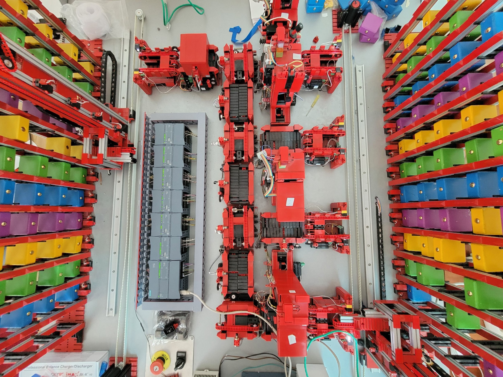

# Lightsout Factory Experiment №1 "Multithreading"

<h3><b>Цель эксперимента "Multithreading":</b></h3>
Обеспечить одновременную доставку нескольких блоков по различным производственным линиям с использованием простейших алгоритмов

 

<h3><b>Демонстрация работы эксперимента:</b></h3>
https://youtu.be/0sLv6yc_6xk

 

<h3><b>Описание эксперимента:</b></h3>
<ul>
  <li>Выбор производственных линий для одновременной обработки нескольких блоков(2)</li>
  <li>Старт обработки первого блока</li>
  <li>Ожидание окончания работы Грузчика начального склада</li>
  <li>Старт обработки второго блока</li>
  <li>Окончание работы над 1ым блоком</li>
  <li>Окончание работы над 2ым блоком</li>
</ul>

 

<h3><b>Описание возможных будущих изменений для эксперимента №2</b></h3>
<ul>
  <li>Добавление режима ожидания для работы со следующим блоком (до момента окончания работы Грузчиков)/li>
  <li>Добавление матрицы заполненности складов блоками</li>
  <li>Настройка всех датчиков высоты и склада на Грузчиках</li>
  <li>Добавление прекращения работы завода без его обесточивания</li>
  <li>Добавление одновременного подъезда и опускания\поднятия Грузчика до производственной линии\склада</li>
</ul>

